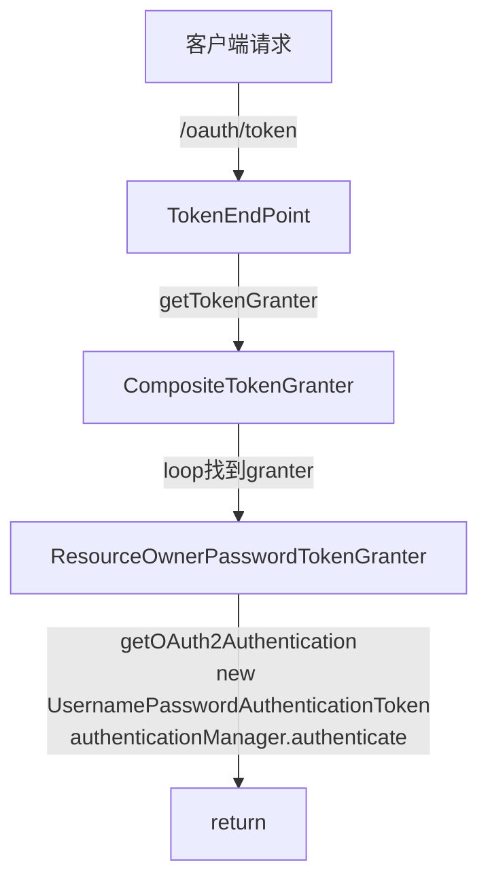

# Spring Security OAuth 获取token

```mermaid
graph TB
A[客户端请求] --/oauth/token-->B[TokenEndPoint]
    B --getTokenGranter--> C[CompositeTokenGranter]
    C --loop找到granter--> D[ResourceOwnerPasswordTokenGranter]
    D --getOAuth2Authentication<br/>new UsernamePasswordAuthenticationToken<br/>authenticationManager.authenticate--> E[return]

```
